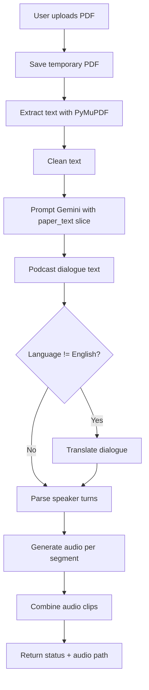
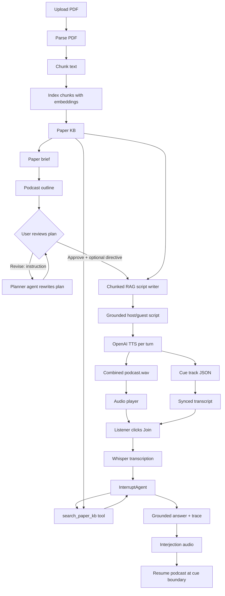
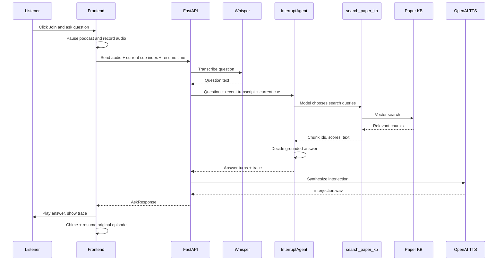

# Agentic RAG Podcast Pipeline

This document explains the standalone `agentic-podcast-rag` prototype: why it exists, how it differs from SARAL's current podcast flow, what is agentic, how RAG is used, how indexing works, and how the user-facing experience is designed.

The prototype intentionally lives outside the SARAL repository so the idea can be demonstrated without changing SARAL production code. The backend structure mirrors SARAL's style: FastAPI routes, service classes, background pipeline stages, local artifacts, and a simple frontend that shows the pipeline state.

## Executive Summary

SARAL currently turns a PDF into a podcast through a mostly linear generation flow:

```text
Upload PDF
  -> Extract text
  -> Clean text
  -> Generate one long podcast dialogue from truncated paper text
  -> Translate if needed
  -> Generate audio clips
  -> Combine audio
  -> Return final audio
```

This works, but the system is mostly a black box. The user does not see the intermediate reasoning scaffold, the script is generated from a limited slice of the paper, retrieval is not explicit, and the generated podcast cannot be interrupted with grounded follow-up questions.

This prototype changes that into an inspectable, RAG-grounded, interactive podcast pipeline:

```text
Upload PDF
  -> Parse + chunk paper
  -> Build paper knowledge base (embeddings + local vector index)
  -> Generate paper brief
  -> Generate episode outline
  -> STOP: user reviews / revises / approves the plan
  -> Generate chunked grounded dialogue (from the approved plan)
  -> Synthesize two-voice podcast audio
  -> Save cue track for transcript sync
  -> Let listener interrupt with voice questions
  -> Agent decides how to search paper KB and answers with trace
```

The most important change is that the pipeline is no longer only "generate a podcast from text." It becomes a paper-specific knowledge system that can plan, retrieve, ground, speak, and answer questions during playback.

## Current SARAL Podcast Flow

SARAL's podcast backend is centered around:

- `backend/app/routes/podcast.py`
- `backend/app/services/podcast_service.py`

The current route handles upload, status tracking, script generation, audio generation, and audio combination. The service extracts PDF text with PyMuPDF, cleans text, prompts Gemini/Sarvam to create a dialogue, parses speaker lines, generates per-turn audio, and combines clips.

### SARAL Workflow



### Characteristics

- **Linear pipeline:** each stage happens in a fixed order.
- **No persistent paper KB:** the system does not build an indexed knowledge base for later retrieval.
- **No explicit retrieval:** the dialogue is generated from supplied paper text, not from a queryable KB.
- **Limited paper context:** the prompt passes a truncated paper slice, e.g. the first several thousand characters, to avoid token limits.
- **Single large script generation:** the full podcast dialogue is generated in one pass.
- **Limited inspectability:** users mainly see final status/audio, not a paper brief, outline, evidence chunks, or tool traces.
- **No live grounded interruption:** a user cannot pause the episode, ask "what does that mean?", and get a paper-grounded answer with provenance.

## Prototype Architecture

The prototype separates the podcast into inspectable artifacts:

- `ParsedDocument`: extracted text and chunks
- `ChunkRecord`: individual paper chunks with embeddings
- `PaperBrief`: problem, method, results, limitations, terms, themes
- `PodcastOutline`: episode plan with segment goals and retrieval queries
- `PodcastScript`: host/guest turns grounded in source chunk ids
- `CueTrack`: timing metadata for transcript sync
- `AskResponse`: listener question answer, audio URL, resume point, and agent trace

### Repository Structure

```text
backend/
  app/
    routes/podcast.py              # upload/status/artifact/audio/interrupt endpoints
    services/document_parser.py    # PDF extraction and chunking
    services/vector_store.py       # embeddings and local vector search
    services/pipeline.py           # staged orchestrator, planner, writer, artifact store
    services/tools.py              # tool definitions exposed to the agent
    services/agent_runner.py       # OpenAI tool-calling loop
    services/interaction_service.py# voice interruption agent
    services/voice_service.py      # TTS, audio combining, cue tracks
    services/summary_service.py    # OpenAI JSON/text client and paper brief
  tests/test_agentic.py            # deterministic tests, no OpenAI calls

frontend/
  src/main.js                      # upload UI, status polling, player, join flow
  src/style.css                    # transcript/interjection/trace styling
```

## End-to-End Prototype Workflow



## Stage-by-Stage Details

### 1. Upload

Endpoint:

```text
POST /api/podcast/upload-pdf
```

The backend creates a `paper_id`, stores status in `data/status/`, and starts the pipeline in the background. The frontend polls the status endpoint so the user sees progress instead of waiting on a blocking request.

### 2. Parse and Chunk

Service:

```text
backend/app/services/document_parser.py
```

The PDF is parsed into text and split into chunks. Each chunk becomes a `ChunkRecord`:

```text
chunk_id
paper_id
text
section
page
embedding
```

Chunking is essential because RAG should retrieve the few passages relevant to the current task, not pass the full PDF into every model call.

### 3. Indexing

Service:

```text
backend/app/services/vector_store.py
```

Indexing converts chunks into embeddings and writes a local JSON vector index under:

```text
backend/app/data/indexes/{paper_id}.json
```

With an OpenAI key, the prototype uses:

```text
text-embedding-3-small
```

If OpenAI embeddings fail or no key is configured, the prototype falls back to a deterministic local hash embedding so tests and demos can still run.

The important design point:

```text
Indexing is offline/per-upload work.
Retrieval is online/per-generation or per-question work.
```

That means the expensive paper ingestion happens once. Later stages search the paper KB using small queries.

### 4. Retrieval

The retrieval interface is `PaperKB.search(...)`, backed by `VectorStore.search_many(...)`.

`search_many` optimizes multi-query retrieval:

- embeds all queries in one batch
- loads chunks from disk once
- scores each chunk against all query embeddings
- keeps the best similarity score per chunk
- returns top results deduplicated

This matters for interruption questions because the best retrieval query is often not just the user's question. For example:

```text
Question: What do you mean by human iPSCs?
Last said: cerebral organoids are created from human iPSCs and treated with drugs...
Current topic: Validation across biological systems
```

The agent can search using all of that context, not only the short phrase `human iPSCs`.

### 5. Paper Brief

Service:

```text
SummaryService
```

The paper brief is a compact global summary:

- title
- one-liner
- problem
- method
- results
- limitations
- key terms
- themes

This is the global memory used by planning and scripting. It prevents later prompts from needing the full paper.

### 6. Podcast Outline

Service:

```text
PlannerService
```

The outline is the "thinking scaffold" the user wanted to see before audio:

```text
Episode title
Hook
Segments:
  - segment_id
  - title
  - goal
  - retrieval_queries
  - estimated_seconds
Closing
```

This is where the system moves away from black-box generation. A user can eventually edit the outline before script/audio generation:

- remove a section
- add a comparison
- make a method section deeper
- explain a figure slowly
- reduce hype
- choose a more technical tone

### Human-in-the-loop approval (implemented)

The pipeline deliberately stops after planning. It does NOT auto-generate audio. This is the core control point of the product.

Flow:

```text
parse -> index -> brief -> outline -> AWAITING_APPROVAL (stop)
```

At this point the user sees the proposed episode plan and can either:

1. Approve and generate, optionally with a global directive (tone, focus, what to skip).
2. Revise the plan with a natural-language instruction, as many times as they want, before generating.

Endpoints:

```text
POST /api/podcast/{paper_id}/outline/revise   { "instruction": "..." }
POST /api/podcast/{paper_id}/generate         { "instruction": "..." }
```

`outline/revise` sends the current plan, the paper brief, and the user instruction to the planner agent, which returns a rewritten outline (remove/add/reorder/refocus/retitle segments and regenerate retrieval queries). The revised plan is saved and shown again.

`generate` is only accepted while the paper is in `AWAITING_APPROVAL`. It starts script + audio generation in the background and threads the optional directive into every beat of the writer. Once generation has started, the plan can no longer be revised (the endpoint returns 409), so the contract the user approved is the contract that gets produced.

Why this matters: most one-shot generators force the user to judge the output only after expensive audio exists, and a regenerate offers no guarantee the important part is covered next time. Here the user sees and steers the plan first, so they know what they will get before any audio cost, and the agent is far less likely to miss the thing they actually cared about.

### 7. Chunked RAG Script Generation

Service:

```text
DialogueService
```

The prototype does not generate one huge podcast script in a single call. It writes the episode beat-by-beat.

For each outline segment, the writer receives:

- global paper brief
- current segment title and goal
- retrieved paper evidence
- short memory of points already covered
- last two dialogue turns from the previous segment
- role of the beat: opening, middle, or closing

This avoids the repeated-introduction problem where every segment starts with "Welcome to today's episode." Only the opening beat may greet the listener. Middle beats must transition from the prior conversation. The closing beat wraps up.

Current implementation status:

- The script writer is **chunked RAG-grounded**.
- Retrieval for each beat is currently orchestrated by code using the outline's retrieval queries.
- The live interruption flow is the first fully tool-calling agent.
- The next engineering step is to move the beat writer onto the same `AgentRunner` pattern so each beat can decide when/how to call `search_paper_kb`.

## Interactive Agentic Interruption Flow

This is the strongest "agentic" part of the current prototype.

Endpoint:

```text
POST /api/podcast/{paper_id}/ask-voice
```

Workflow:



### What Makes This Agentic

The model is not merely handed pre-retrieved evidence. It receives a tool:

```text
search_paper_kb(queries, top_k)
```

The model chooses:

- whether to search
- what search queries to use
- whether to search again with improved queries
- how to use retrieved chunk ids in the answer

After the observed issue where the model skipped search for `human iPSCs`, the interruption runner now requires the first KB search for listener questions. This is intentional: in a paper-grounded podcast, nearly every interruption should be anchored in the paper or the current transcript. The agent still chooses the queries and can decide follow-up tool usage, but it cannot answer a paper-context question without checking the KB first.

### Agent Trace

Every tool call is returned to the frontend as a `trace`:

```text
tool
arguments
result_summary
chunk_ids
```

The UI displays this below the interjection answer:

```text
Agent trace · 1 tool call
search_paper_kb
What do you mean by human iPSCs? · cerebral organoids are created from human iPSCs...
3 passages (top score 0.82): chunk_12, chunk_09, chunk_14
```

This makes the agent's behavior visible. The demo can show not only the answer, but how the answer was grounded.

## Voice and Cue Tracking

Service:

```text
VoiceService
```

The prototype synthesizes a separate WAV clip for each host/guest turn:

- host voice: `onyx`
- guest voice: `nova`
- model: `OPENAI_TTS_MODEL`, default `tts-1`

The clips are combined with `pydub` into:

```text
data/audio/{paper_id}/podcast.wav
```

At the same time, the system records a cue track:

```text
data/cues/{paper_id}.json
```

Each cue contains:

```text
index
segment_id
segment_title
speaker
text
start_ms
end_ms
source_chunk_ids
```

The frontend uses this for:

- live transcript highlighting
- knowing what the listener interrupted
- passing the current cue to the interrupt agent
- resuming at the start of the interrupted turn instead of mid-word

## Token Strategy

The prototype follows the offline/online split discussed during design.

### Avoid This

```text
For every podcast segment:
  send full PDF
  send full previous script
  send long prompt
  ask model to regenerate everything
```

That is expensive and also increases repetition.

### Use This

```text
For every podcast segment:
  send compact paper brief
  send current segment plan
  send 3-5 retrieved chunks
  send short memory of prior covered points
  send last 1-2 verbatim turns
```

For live questions:

```text
send listener question
send current cue
send recent transcript window
let agent call search_paper_kb
return only retrieved chunks, not full paper
```

### Concrete Optimizations Already Implemented

- chunks are indexed once after upload
- query embeddings are batched with `search_many`
- chunks are loaded once per multi-query search
- tool results are trimmed before being sent to the model
- `top_k` is capped
- tool loop has a hard iteration budget
- final tool round disables tools to prevent infinite loops
- previous episode context is compressed into recaps, not full transcript

## SARAL vs Prototype

| Area | SARAL Current Flow | Agentic RAG Prototype |
|---|---|---|
| Input | PDF upload | PDF upload |
| Parsing | PyMuPDF extraction | PDF extraction + chunk records |
| Context strategy | Truncated paper text in prompt | Indexed paper KB + retrieved chunks |
| Script generation | One long dialogue generation | Segment-by-segment grounded generation |
| Planning | Mostly implicit in prompt | Explicit `PodcastOutline` artifact |
| User visibility | Status + final audio | Brief, outline, script, transcript, trace |
| RAG | Not explicit | Local vector index + `search_paper_kb` |
| Agentic tool use | No model tool-calling | InterruptAgent uses OpenAI tool calling |
| Interruption | Not supported | Voice question -> retrieval -> grounded answer -> resume |
| Source grounding | Not structured | `source_chunk_ids` on turns and answers |
| Audio sync | Final combined audio | Cue track with per-turn timings |
| Token use | Large paper slice per generation | Brief + segment + retrieved chunks + memory |

## What We Have Built

Implemented in the prototype:

- SARAL-like FastAPI backend shape
- upload/status/artifact endpoints
- PDF parsing and chunking
- local vector index
- OpenAI embeddings with deterministic fallback
- paper brief generation
- podcast outline generation
- human-in-the-loop approval gate (pipeline pauses at the plan)
- natural-language plan revision via the planner agent
- approved-plan generation with an optional user directive threaded into the writer
- chunked RAG dialogue writer
- two-voice OpenAI TTS
- combined WAV podcast output
- cue track for synced transcript
- frontend player and live transcript
- "Join" flow for user voice interruption
- Whisper transcription
- tool-calling `InterruptAgent`
- `search_paper_kb` tool
- budgeted `AgentRunner`
- visible frontend agent trace
- deterministic tests for timing, greeting continuity, tool loop, required first search, and budget guard

## Current Limitations

- The beat writer is RAG-grounded and memory-aware, but not yet fully tool-calling. Retrieval is selected by code from outline queries. The interruption agent is the current fully tool-calling piece.
- **`web_search`** (interrupt agent only): public web background when the paper uses but does not define a term (e.g. "what is RAG"). Uses DuckDuckGo by default; optional `TAVILY_API_KEY` for higher quality. Answers from web are labeled `grounded=false` and shown in the agent trace with source URLs.
- Figures/tables are not yet extracted as visual artifacts for synchronized display.
- Plan review is driven by natural-language instructions plus a read-only segment list. Inline per-segment editing (drag-reorder, click-to-delete) is a possible UI enhancement, but the instruction-based flow already gives full control.
- The demo uses local JSON files for artifacts and indexes; SARAL production would likely use durable storage and job tracking.

## Recommended Next Steps

1. Move the beat writer onto `AgentRunner` so each podcast beat can decide when/how to call `search_paper_kb`.
2. Add inline plan editing (reorder/delete/add segments) on top of the existing approval + revise flow.
3. Add figure/table extraction so script turns can reference visual anchors.
4. Optional OpenAI Realtime for live voice interruption (currently TTS + Whisper).

## Porting Strategy Back To SARAL

The safest SARAL integration path is incremental:

1. Keep SARAL's current podcast endpoint working.
2. Add a new agentic podcast route or feature flag.
3. Introduce paper chunking and indexing as a separate stage.
4. Add brief and outline artifacts.
5. Replace single script generation with chunked RAG generation.
6. Add cue track generation during audio synthesis.
7. Add the interrupt endpoint and `search_paper_kb` tool.
8. Add UI affordances: pipeline scaffold, transcript, Join button, agent trace.

This avoids a risky rewrite and makes the agentic behavior testable stage by stage.

## Bottom Line

SARAL's current podcast path is a useful linear generator. This prototype turns the same user goal into a paper-grounded, inspectable, interactive system.

The key shift is:

```text
From: "Generate a podcast from this PDF text."
To:   "Build a paper knowledge base, plan an episode, retrieve evidence as needed,
       speak a grounded dialogue, and let the listener ask questions mid-episode."
```

That is the foundation for an agentic podcast pipeline.
