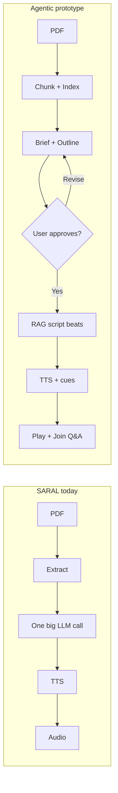
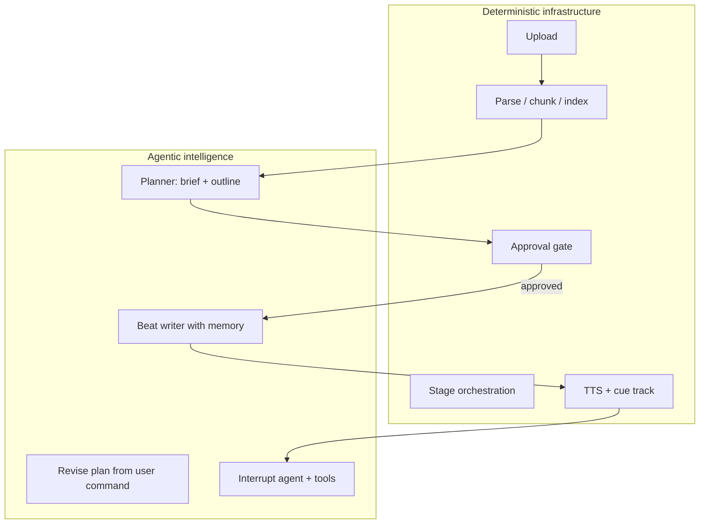
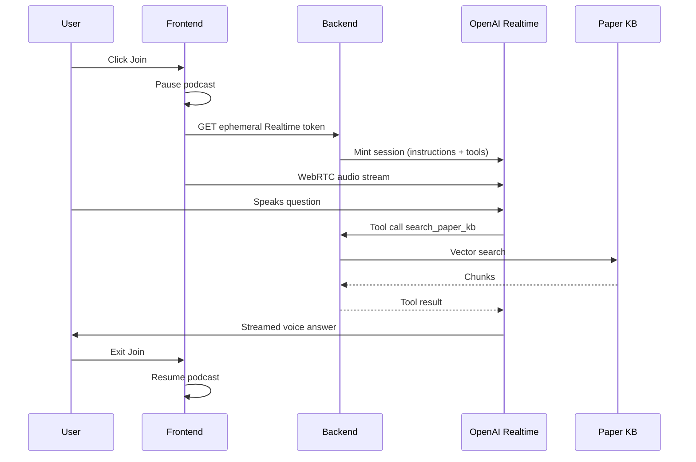

# Agentic RAG Podcast — Presentation Document

**Standalone prototype for SARAL** · `agentic-podcast-rag`  
**Purpose:** Show how paper-to-podcast can move from a black-box generator to an **inspectable, user-steered, RAG-grounded, interactive** pipeline.

---

## 1. The Problem We Are Solving

Today, when someone uploads a research paper to get a podcast:

- They **do not know** what the episode will cover until audio is already generated.
- If the episode misses the one thing they care about (case study, method, limitations), they must **regenerate and hope**.
- The pipeline is mostly a **black box**: upload → wait → audio.
- There is **no paper knowledge base** — the model sees a truncated slice of text.
- The listener **cannot interrupt** and ask grounded questions mid-episode.

**Goal:** Turn podcast generation into a **controlled agentic system** where the user sees the plan, steers the agent, gets grounded output, and can join the conversation — without making the whole product fragile or expensive.

---

## 2. One-Sentence Pitch

> We index the paper once, the agent proposes an episode plan, the user approves or revises it, the system generates a RAG-grounded podcast from that approved plan, and during playback the listener can interrupt — with an agent that chooses when to search the paper or the web and shows its reasoning in a trace.

---

## 3. SARAL Today vs Our Prototype

### 3.1 SARAL current podcast flow

```text
Upload PDF
  → Extract text (PyMuPDF)
  → Clean text
  → One large Gemini prompt with ~8k chars of paper text
  → Full podcast dialogue in one shot
  → (Optional) translate via Sarvam
  → TTS per line (Sarvam) → combine audio
  → User gets final audio
```

**Characteristics**

| Aspect | SARAL today |
|--------|-------------|
| Architecture | Linear, single-pass |
| Paper context | Truncated text in prompt |
| Retrieval | None (implicit in prompt) |
| User control before audio | None |
| Inspectable artifacts | Status + final audio |
| Grounding | Not structured (no chunk IDs) |
| Interruption | Not supported |
| Voice stack | Sarvam TTS + audio workers |
| LLM | Gemini (+ Sarvam fallback) |

### 3.2 Our prototype flow

```text
Upload PDF
  → Parse + chunk (pypdf — demo; SARAL uses PyMuPDF in prod)
  → Index chunks (embeddings → local vector store)     [OFFLINE]
  → Paper brief
  → Episode outline
  → STOP — user reviews / revises / approves           [HUMAN GATE]
  → Chunked RAG script (beat-by-beat, with memory)
  → OpenAI TTS (host + guest) + cue track
  → Play podcast + synced transcript
  → User can "Join" — interrupt agent answers with tools + trace
```

**Characteristics**

| Aspect | Our prototype |
|--------|----------------|
| Architecture | Staged pipeline + agentic layers |
| Paper context | Indexed KB; retrieve per beat / per question |
| Retrieval | Explicit `search_paper_kb` (+ optional `web_search`) |
| User control before audio | **Outline approval + natural-language steering** |
| Inspectable artifacts | Brief, outline, script, cues, agent trace |
| Grounding | `source_chunk_ids` on turns; tool trace in UI |
| Interruption | Voice Q&A with tool-calling agent |
| Voice stack | OpenAI TTS + Whisper (interrupt path) |
| LLM | OpenAI (gpt-4o-mini class) |

### 3.3 Side-by-side diagram



---

## 4. User Experience Flow (What the User Actually Sees)

This is the story to tell in the demo.

### Phase A — Upload & analysis (automatic)

1. User uploads a research PDF.
2. UI shows pipeline progress:
   - Reading paper
   - Building knowledge base
   - Summarizing
   - Planning episode
3. User waits ~1–2 minutes (depends on paper size and API).

**User mental model:** *"SARAL is reading and planning my episode."*

### Phase B — Episode plan review (human in the loop) ⭐ Key differentiator

4. Pipeline **stops**. No audio is generated yet.
5. UI shows **Episode plan** — numbered segments, e.g.:
   - What problem is this paper solving?
   - Core method
   - Validation case study
   - Limitations
   - Why this matters
6. User reads the plan and chooses:
   - **Generate podcast** — if the plan looks good
   - **Revise plan** — type an instruction, e.g.:
     - *"Skip the history. Focus on the case study and human iPSCs. Use a technical tone, no hype."*
7. Agent revises the outline; user can revise again until satisfied.
8. User clicks **Generate podcast**.

**User mental model:** *"I know exactly what I'm going to get before any audio cost."*

### Phase C — Generation (deterministic execution from approved plan)

9. UI shows: Writing dialogue → Creating audio.
10. System generates script **beat-by-beat** from the approved outline (not one giant prompt).
11. Each beat retrieves fresh evidence from the paper KB.
12. Two-voice podcast audio is synthesized; cue track saved for sync.

### Phase D — Listen & join (interactive)

13. User presses play — synced transcript highlights the current speaker/turn.
14. User clicks **Raise hand & ask** at any moment.
15. Podcast pauses; user speaks a question.
16. Interrupt agent:
    - Transcribes (Whisper)
    - **Must** search paper KB first
    - May call **web search** if the paper uses but doesn't define a term (e.g. "what is RAG?")
    - Answers in 2–3 short spoken turns
    - UI shows **Agent trace** (which tools, what queries, what was found)
17. Answer plays; chime; episode resumes from a clean cue boundary.

**User mental model:** *"I'm in a podcast, but I can ask the hosts to explain — and I can see how they looked it up."*

---

## 5. Architecture: Offline vs Online

We deliberately split **indexing (offline)** from **retrieval + generation (online)**.

```text
OFFLINE (once per upload)
  PDF → parse → chunk → embed → save index to disk

ONLINE (per beat, per question)
  query → embed → search top-k chunks → LLM with small context
```

**Why this matters for tokens and cost**

- Never send the full PDF to the LLM on every call.
- Per beat: brief + segment plan + 3–5 chunks + short memory (~recap + last 2 turns).
- Per interrupt: question + recent transcript + tool results only.

---

## 6. What Is Agentic vs What Is Deterministic

This is the most important design slide for the presentation.

### Principle

> **Agentic where judgment is needed. Deterministic where reliability matters.**

We did **not** build "two autonomous agents talking forever." That would be fragile, expensive, and hard to control. Instead:

```text
Deterministic scaffold  +  Agentic planning & retrieval  +  Deterministic execution
```

### 6.1 Deterministic (fixed, reliable, inspectable)

| Step | Why deterministic |
|------|-------------------|
| PDF upload & storage | Same input → same ingest path |
| Chunking & embedding | Reproducible index |
| Pipeline stage order | Parse → index → brief → outline → **gate** → script → voice |
| Approval gate | Audio **never** starts without user clicking Generate |
| Beat loop structure | One outline segment → one script beat |
| Running memory | Recap + last 2 turns passed forward (no full script replay) |
| TTS & cue timing | Fixed host/guest voices; deterministic timestamps |
| Tool budget | Max iterations per interrupt; first call must be paper KB |
| Tests | Greeting once per episode, cue math, tool loop, approval gate |

### 6.2 Agentic (model decides, user can steer)

| Step | What the agent decides |
|------|------------------------|
| **Paper brief** | Themes, problem, method, results from paper |
| **Episode outline** | Segment titles, goals, retrieval queries |
| **Outline revision** | Rewrites plan from user's natural-language instruction |
| **Per-beat dialogue** | Wording, transitions, which evidence to use (within retrieved chunks) |
| **Interrupt Q&A** | Whether paper KB is enough; when to call **web_search**; how to classify clarification vs new fact vs out-of-scope |
| **Tool queries** | What to search (question + last spoken line + topic) |

### 6.3 Hybrid (agent-assisted, code-orchestrated)

| Step | How it works today |
|------|---------------------|
| Script beat retrieval | Code runs `search_paper_kb` using outline's `retrieval_queries`; then LLM writes the beat |
| Interrupt retrieval | **Model** chooses tools via OpenAI function calling (`AgentRunner`) |
| Grounding policy | Prompt rules + `grounded` flag + trace for inspectability |

**Future (optional):** Move beat writer onto the same tool-calling `AgentRunner` so each beat also decides its own retrieval — still within the approved outline.

### 6.4 Visual: agentic vs deterministic map



---

## 7. RAG & Tools (The Agentic Core)

### 7.1 Paper knowledge base

- Chunks stored with embeddings (`text-embedding-3-small`).
- Local JSON index per paper.
- `search_paper_kb(queries, top_k)` — multi-query search in one embedding batch.

### 7.2 Tools available to the interrupt agent

| Tool | Purpose | When to use |
|------|---------|-------------|
| `search_paper_kb` | Evidence from **this paper** | Always first (required) |
| `web_search` | General background (DuckDuckGo or Tavily) | Paper uses a term but doesn't define it (e.g. "what is RAG?", "what are iPSCs?") |

### 7.3 Tool-calling loop (`AgentRunner`)

```text
Model receives question + transcript context + tool schemas
  → may call search_paper_kb
  → may call web_search
  → returns JSON answer + grounded flag
Every tool call logged in trace (tool name, queries, result summary, URLs)
Budget: max 4 iterations; first iteration forces paper KB search
```

### 7.4 Provenance / honesty

- **Paper claims** → cite `source_chunk_ids`, `grounded=true`
- **Web background** → `grounded=false`, say it's general background not from the paper
- **Not in paper** → say so; don't invent

---

## 8. Why We Chose This Over "Fully Agentic"

We explicitly discussed and **rejected** (for now):

### Option A — Fully autonomous podcast agents

Two LLM agents talk to each other with no fixed plan; long-running improvisation.

**Problems**

- Unpredictable coverage (misses what user cares about)
- Repeated intros / drift (we already saw this in early chunked experiments)
- High token + audio cost
- Hard to debug and demo
- Fragile for production

### Option B — What we built instead ✅

```text
Agent proposes plan → User steers → Deterministic generation from approved plan
```

**Benefits**

- User knows what they'll get
- Cheaper (no audio until approved)
- Still genuinely agentic (planning, revision, tool use on interrupt)
- Reliable enough to demo and port to SARAL

**Positioning line for slides:**

> *"Agentic doesn't mean autonomous chaos. It means the system can plan, retrieve, revise, and respond — while the user stays in control."*

---

## 9. Voice: What We Have vs OpenAI Realtime (Proposed)

### 9.1 Current implementation (shipped in prototype)

| Component | Technology |
|-----------|------------|
| Main podcast | Pre-generated script → OpenAI TTS (`onyx` / `nova`) → combined WAV |
| Transcript sync | Cue track (start/end ms per turn) |
| Interrupt | Pause → mic → Whisper → text agent + tools → TTS answer → resume |

**Pros:** Predictable, cheaper, full script inspectable before listen, works with approval gate.  
**Cons:** Interrupt feels like "ask → wait → audio file" not live conversation.

### 9.2 Proposed: OpenAI Realtime API (future)

**Scope we agreed on:** Hybrid — not live-generate the whole podcast.

```text
Main episode: still pre-generated (approved plan → script → TTS)

"Join" mode: switch to Realtime WebRTC session
  → user speaks naturally
  → live agent listens + responds by voice
  → agent can call search_paper_kb (and web_search) via backend
  → trace still visible in UI
  → exit live mode → resume podcast from cue
```

**Architecture sketch**



**Why Realtime fits here**

- Removes Whisper + TTS latency for interrupts
- Feels like "joining the conversation"
- Still agentic (tools during live session)

**Why NOT Realtime for full episode generation**

- Cost scales with episode length
- Hard to enforce approved outline beat-by-beat
- Loses inspectable script-before-audio workflow

### 9.3 Long-running two Realtime agents talking to each other (discussed, deferred)

Concept: two Realtime sessions (host agent + guest agent) co-hosting live with no pre-script.

| Pros | Cons |
|------|------|
| Very "wow" demo | Expensive at scale |
| Truly emergent dialogue | Unpredictable content |
| | Hard to ground in paper |
| | Difficult to sync with visuals/cues later |

**Recommendation for SARAL roadmap:** Realtime for **interrupt/join only** first; keep episode generation on approved-plan + RAG + TTS.

---

## 10. Token & Cost Strategy

| Mistake to avoid | What we do instead |
|------------------|---------------------|
| Full PDF every LLM call | Index once; retrieve top-k |
| Full prior script every beat | Recap sentence + last 2 turns |
| Generate audio before user approval | Stop at outline |
| Unbounded tool loops | Hard iteration cap |
| Huge evidence in prompts | Trim chunks (~500 chars) |
| Multi-query = multi embed call | `search_many` batches queries |

---

## 11. Known Limitations (Be Honest in Q&A)

1. **PDF extraction (pypdf in demo):** Can produce garbled text (missing spaces). SARAL uses PyMuPDF — port should upgrade parser. Bad chunks → bad retrieval → bad answers (not always "hallucination").
2. **Chunk IDs in spoken text:** Model sometimes reads metadata aloud — needs stricter prompts + post-processing (known issue).
3. **Beat writer retrieval:** Still code-orchestrated from outline queries; interrupt path is fully tool-calling.
4. **No synced visuals yet:** Figure/table highlight on cue is future work.
5. **Separate repo:** Prototype only; not merged into SARAL main.

---

## 12. Demo Script (5–7 minutes)

1. **Upload** a paper → show pipeline stages.
2. **Stop at plan** → read segments aloud.
3. **Revise:** *"Remove background, go deeper on case study, explain iPSCs."* → show updated plan.
4. **Generate** → show script stages → play audio.
5. **Transcript** follows playback.
6. **Join** → ask: *"What do you mean by testable hypotheses?"* → show agent trace (KB search, maybe web).
7. **Compare** to SARAL: one-shot, no plan, no interrupt, no trace.

---

## 13. SARAL Porting Roadmap (Incremental)

```text
Phase 1 — Keep existing podcast route; add feature flag
Phase 2 — Chunk + index on upload
Phase 3 — Brief + outline artifacts + approval UI
Phase 4 — Chunked RAG script generation
Phase 5 — Cue track + player + Join
Phase 6 — Tool-calling interrupt agent
Phase 7 — (Optional) Realtime for Join mode only
Phase 8 — Better PDF parser (PyMuPDF / GROBID)
```

Each phase is shippable independently — no big-bang rewrite.

---

## 14. Key Messages for Tomorrow

1. **Problem:** Black-box podcast gen wastes time and misses user intent.
2. **Solution:** Index paper → agent plans → **user approves** → grounded generation → interactive Q&A.
3. **Agentic ≠ autonomous:** Controlled agency with deterministic rails.
4. **RAG:** Offline index, online retrieval, provenance on answers.
5. **vs SARAL:** Same user goal, fundamentally different architecture (KB, plan gate, tools, trace).
6. **Voice future:** Realtime for Join, not for replacing the whole pipeline.
7. **Production path:** Incremental port behind feature flag; PyMuPDF for parsing.

---

## 15. Repo & Endpoints Quick Reference

**Repo:** `agentic-podcast-rag` (sibling to SARAL — zero changes to SARAL main)

| Endpoint | Role |
|----------|------|
| `POST /upload-pdf` | Start planning (stops at outline) |
| `GET /outline` | Get episode plan |
| `POST /outline/revise` | User instruction → revised plan |
| `POST /generate` | Approve → script + audio |
| `GET /cues` | Transcript sync |
| `POST /ask-voice` | Interrupt Q&A |
| `GET /health` | Should return `"pipeline":"approval-gated-v2"` |

**Health check before demo:** If `/health` doesn't show `approval-gated-v2`, restart backend — old server auto-generates audio.

---

## 16. Glossary

| Term | Meaning |
|------|---------|
| **Paper KB** | Indexed chunks + embeddings for one paper |
| **Beat** | One outline segment's dialogue (chunked generation unit) |
| **Recap** | One-sentence memory of what a beat covered |
| **Cue track** | Timestamps for each spoken turn |
| **Grounded** | Answer supported by paper evidence |
| **Agent trace** | Log of tool calls the model chose to make |
| **Approval gate** | Pipeline pause until user clicks Generate |

---

*Document version: aligns with prototype as of approval-gated pipeline, outline revise/generate, interrupt tool-calling (search_paper_kb + web_search), OpenAI TTS + Whisper join flow.*
